# Juan Carlos Gómez-García

**Socio-environmental Researcher | GIS, Thematic Cartography, and Territorial Analysis**  
**Location:** Colombia  
**Email:** [jgomezgarciafl@flacso.edu.ec](mailto:jgomezgarciafl@flacso.edu.ec)  
**LinkedIn:** [linkedin.com/in/jcgomezga](https://www.linkedin.com/in/jcgomezga/)  
**CV:** [JuanCarlosGomezGarcia_CV_2026_EN.pdf](JuanCarlosGomezGarcia_CV_2026_EN.pdf)

---

## Overview

I develop maps and spatial outputs that help make territory readable, communicable, and analytically useful. My work sits at the intersection of **GIS**, **thematic cartography**, **territorial analysis**, and **socio-environmental research**, with experience supporting indigenous territorial processes, community-based initiatives, environmental interpretation, and institutional reporting.

This portfolio brings together selected projects focused on **indigenous territorial mapping**, **spatial organization of social information**, **environmental cartography**, and **map production for research and decision-making**.

I collaborate with **universities, NGOs, foundations, public institutions, and community processes** that need rigorous geospatial products, clear visual communication, and context-sensitive territorial analysis.

---

## Areas of Work

- Thematic cartography
- GIS-based territorial analysis
- Indigenous and community territorial mapping
- Spatial delimitation and georeferencing
- Land cover and environmental mapping
- Satellite imagery interpretation
- Cartographic layouts for technical, academic, and institutional use
- Spatial data cleaning, organization, and visualization

---

# Selected Projects

## 1. Natacoy Pijao Indigenous Reserve

**Location:** Natagaima, Tolima  
**Year:** 2024  
**Project focus:** Territorial cartography, spatial delimitation, indigenous land mapping

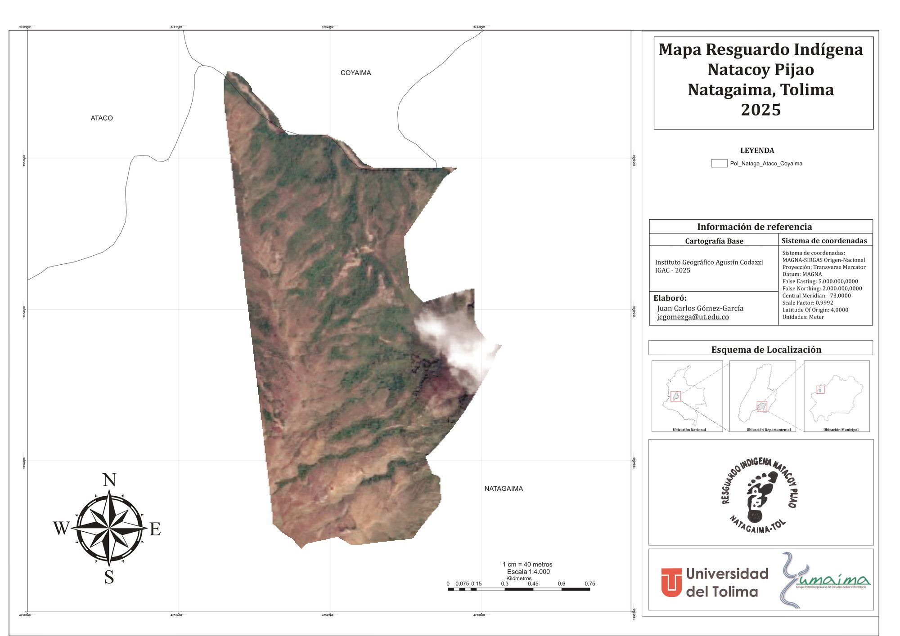

Cartographic composition developed to locate and delimit the reserve using reference cartography, coordinate grids, and satellite imagery. The map was designed to support territorial interpretation and institutional presentation, while providing a clear spatial reading of the reserve in relation to its surroundings.

**Workflow and tools:** QGIS, vector layer editing, satellite imagery integration, cartographic layout design

---

## 2. Castilla Angostura Indigenous Reserve

**Location:** Coyaima, Tolima  
**Year:** 2024  
**Project focus:** Community cartography, territorial analysis, georeferencing

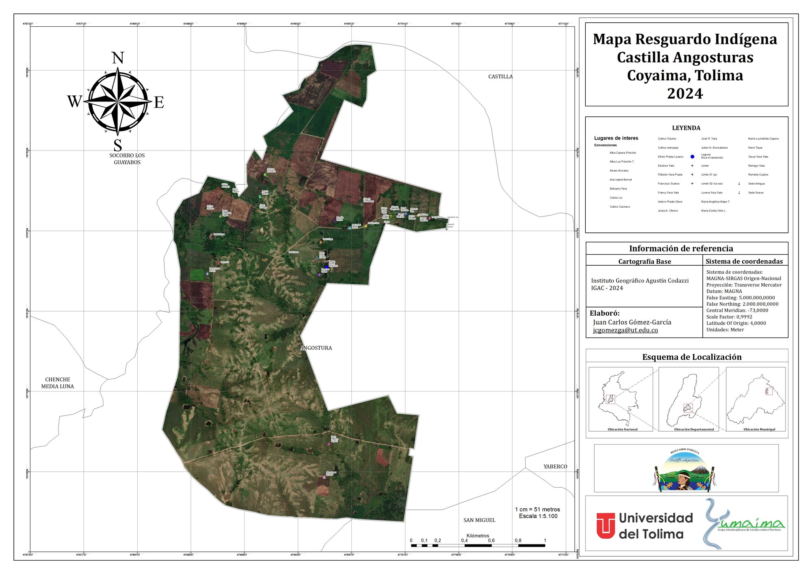

Detailed territorial map produced to represent the reserve, key reference points, and its spatial context. The composition integrates orthophoto support, thematic symbology, coordinate reference information, and an inset location map to improve spatial interpretation.

**Workflow and tools:** QGIS, georeferencing, thematic symbology, multiscalar map composition

---

## 3. Pijao Families of Cacica Dulima

**Location:** Ibagué, Tolima  
**Year:** 2024  
**Project focus:** Social cartography, spatial distribution, urban and peri-urban analysis

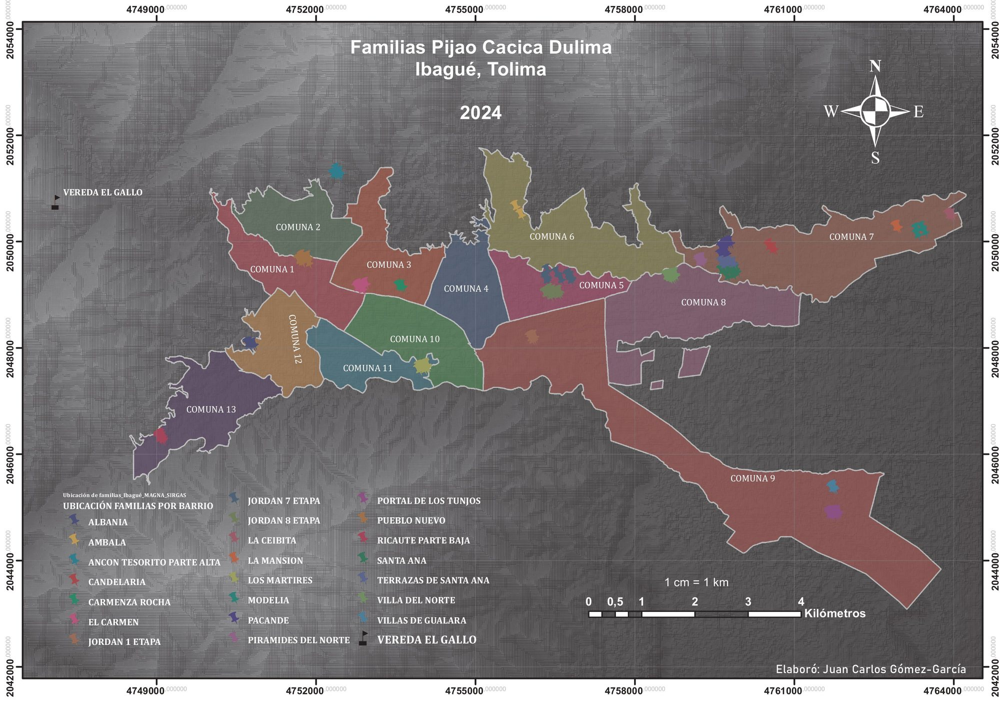

Map developed to represent the territorial distribution of families across urban neighborhoods and rural villages in Ibagué. The output was designed as a useful spatial input for population characterization, territorial reading, and organizational processes.

**Workflow and tools:** QGIS, spatial database organization, thematic representation, social cartography

---

## 4. El Tecal Indigenous Community

**Location:** Saldaña, Tolima  
**Year:** 2025  
**Project focus:** Thematic cartography, territorial organization, GIS

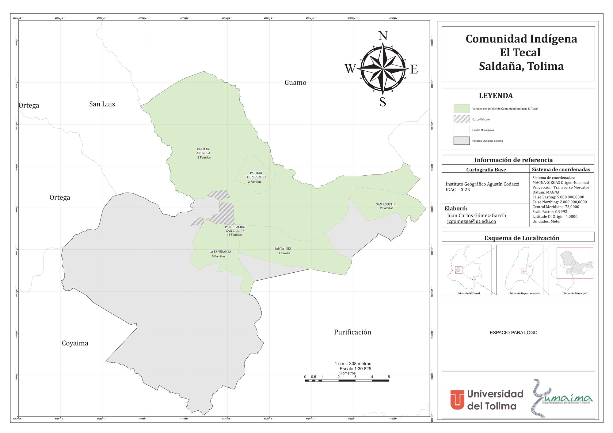

Thematic map showing the location of the indigenous population by village within the municipality of Saldaña. The design combines territorial information, municipal boundaries, the urban center, and locator references, with emphasis on clarity and thematic readability.

**Workflow and tools:** QGIS, territorial delimitation, administrative layers, thematic map composition

---

## 5. Ibanasca Indigenous Community

**Location:** Saldaña, Tolima  
**Year:** 2025  
**Project focus:** Population location mapping, municipal cartography, territorial analysis

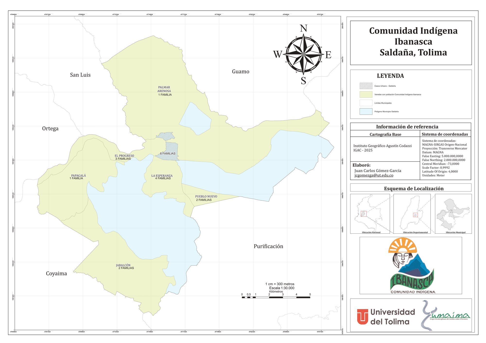

Municipal-scale map created to represent the territorial location of the Ibanasca indigenous community. The layout integrates base cartography, village-level distribution, scale references, and spatial orientation elements for characterization and territorial analysis.

**Workflow and tools:** QGIS, spatial data organization, thematic cartography, map layout preparation

---

## 6. Comuneros Catufa Indigenous Community

**Location:** Saldaña, Tolima  
**Year:** 2025  
**Project focus:** Community cartography, territorial analysis, thematic mapping

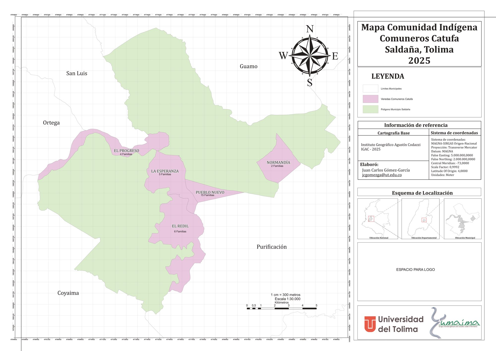

Territorial representation of the Comuneros Catufa community, focused on the spatial distribution of population and its relationship to municipal territorial units. The final product was prepared for both technical reading and institutional presentation.

**Workflow and tools:** QGIS, vector editing, cartographic composition, territorial analysis

---

## 7. Lake Tota Pre-Registrations Mapping

**Location:** Lake Tota Basin, Boyacá  
**Year:** 2023  
**Project focus:** Territorial analysis, spatial prioritization, thematic mapping

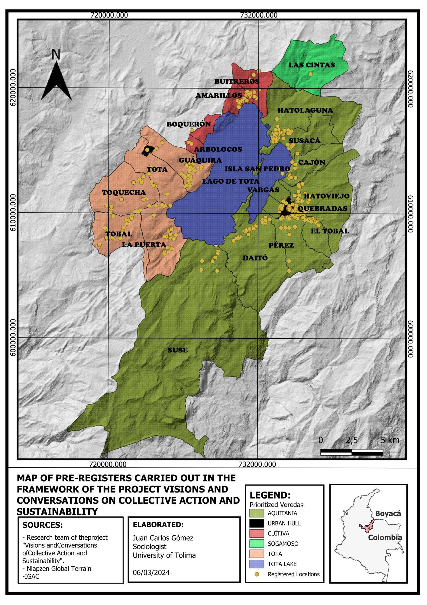

Thematic map designed to locate prioritized sites and villages around the Lake Tota basin. The project organizes registered points and strategic territorial units into a clear visual product for analysis, communication, and territorial decision support.

**Workflow and tools:** QGIS, spatial organization of records, thematic mapping, technical layout design

---

# Additional Projects

## Boyacá DEM

**Project focus:** Physical-territorial analysis, relief representation

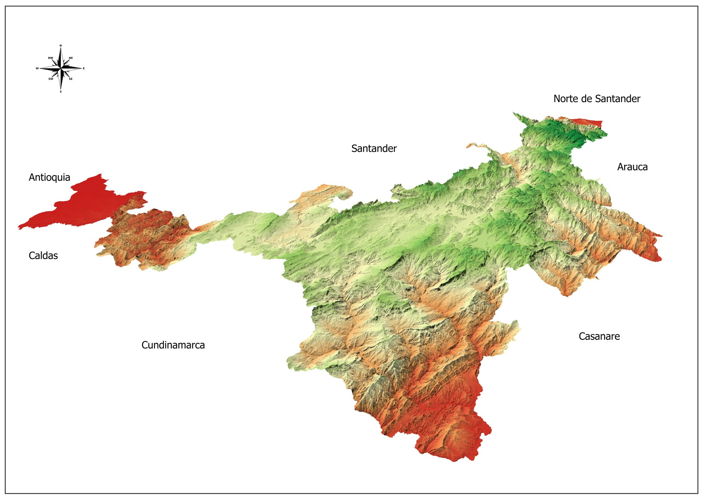

Map derived from a digital elevation model for terrain reading and relief representation. This type of output supports geomorphological interpretation, topographic pattern identification, and environmental analysis.

---

## Watershed Mapping

**Project focus:** Environmental cartography, hydrographic delimitation

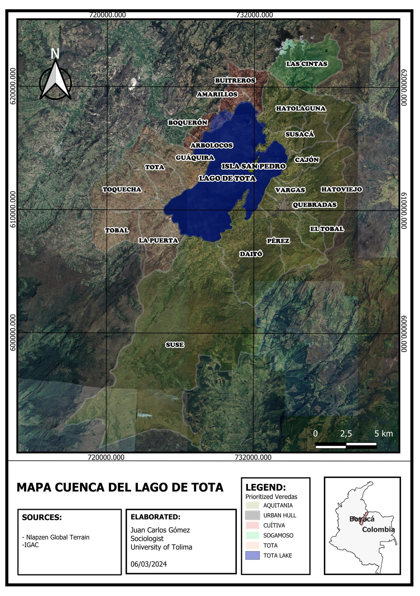

Cartographic product focused on the representation of a hydrographic unit and its spatial structure. It integrates delimitation, territorial reading, and thematic visualization for environmental analysis.

---

## Vegetation Cover in La Victoria

**Project focus:** Land cover analysis, environmental mapping

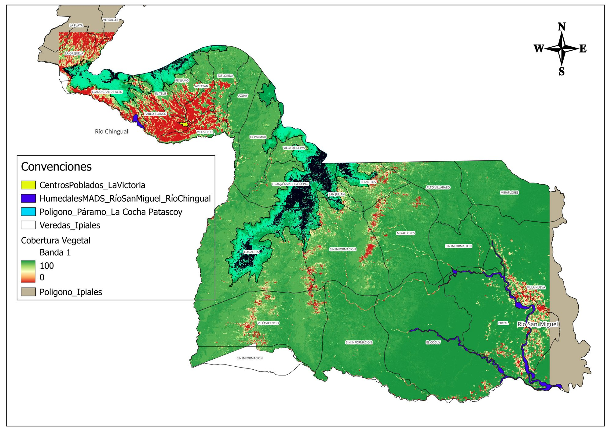

Thematic map developed to represent spatial patterns of vegetation cover and land occupation. This type of analysis is useful for environmental diagnostics and territorial planning processes.

---

## Cajamarca Polygon Delimitation

**Project focus:** Spatial delimitation, precision mapping

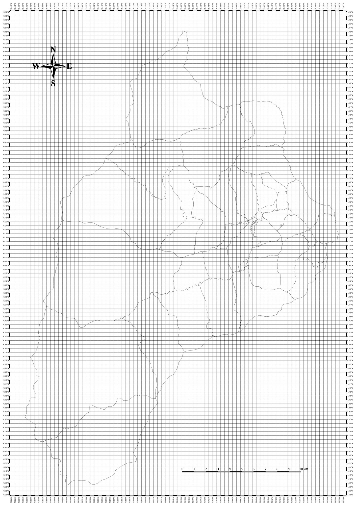

Map created to visualize a delimited area of interest with coordinate grid support, useful for precise spatial representation and territorial analysis.

---

## Barzaloza Indigenous Community

**Location:** Natagaima, Tolima  
**Year:** 2024  
**Project focus:** Territorial delimitation, satellite-supported cartography

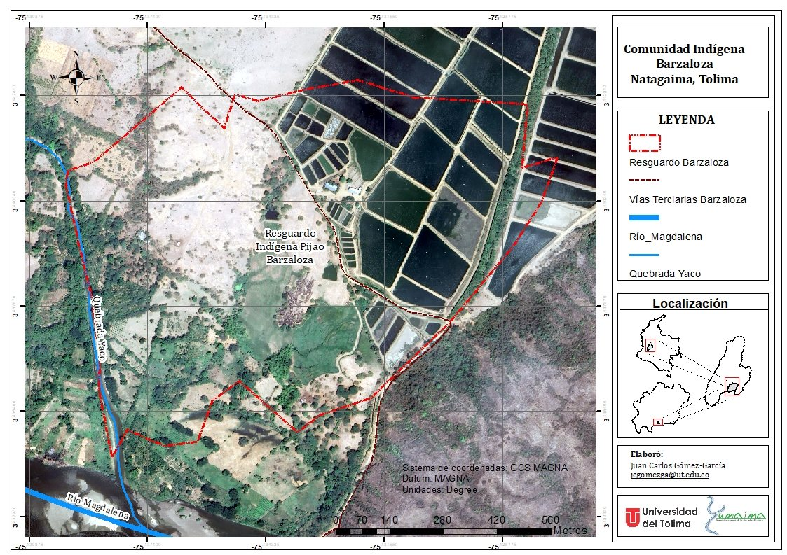

Territorial delimitation map developed with satellite-image support and the representation of main roads and drainage features. The product enables a clear reading of the reserve and its immediate physical context.

---

## Pueblo Nuevo Indigenous Community

**Location:** Natagaima, Tolima  
**Year:** 2024  
**Project focus:** Territorial cartography, hydrological and road network representation

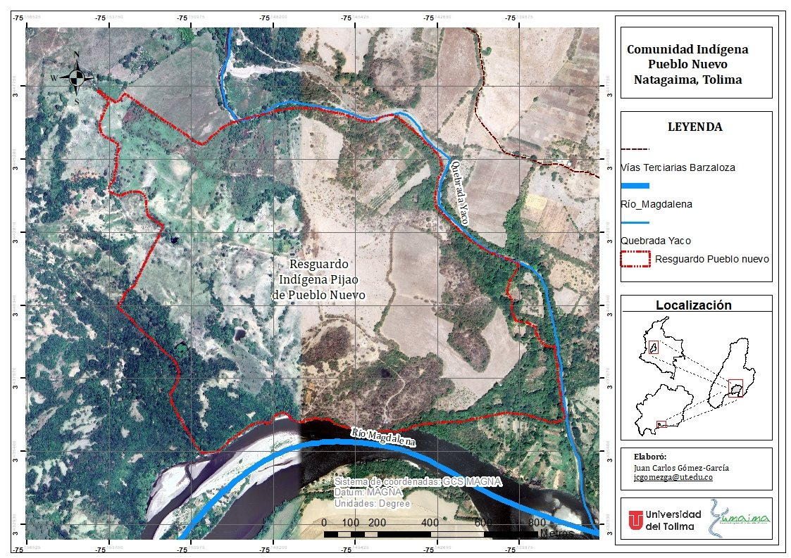

Territorial map produced with satellite imagery, drainage network, and road layout to support the spatial representation of the reserve and its main territorial reference elements.

---

# Methods and Tools

My typical workflow combines:

- QGIS and GIS-based map production
- Vector and raster data management
- Georeferencing and spatial cleaning
- Thematic symbology and visual hierarchy
- Satellite imagery interpretation
- Cartographic composition for reports, presentations, and institutional use
- Integration of spatial and social information for territorial analysis

I also work with broader research workflows that connect spatial analysis with socio-environmental inquiry, field data organization, and applied territorial diagnostics.

---

# Contact

For collaborations in **cartography**, **GIS support**, **territorial analysis**, or **map production for research and projects**, feel free to reach out.

**Email:** [jgomezgarciafl@flacso.edu.ec](mailto:jgomezgarciafl@flacso.edu.ec)  
**LinkedIn:** [linkedin.com/in/jcgomezga](https://www.linkedin.com/in/jcgomezga/)  
**CV:** [JuanCarlosGomezGarcia_CV_2026_EN.pdf](JuanCarlosGomezGarcia_CV_2026_EN.pdf)
